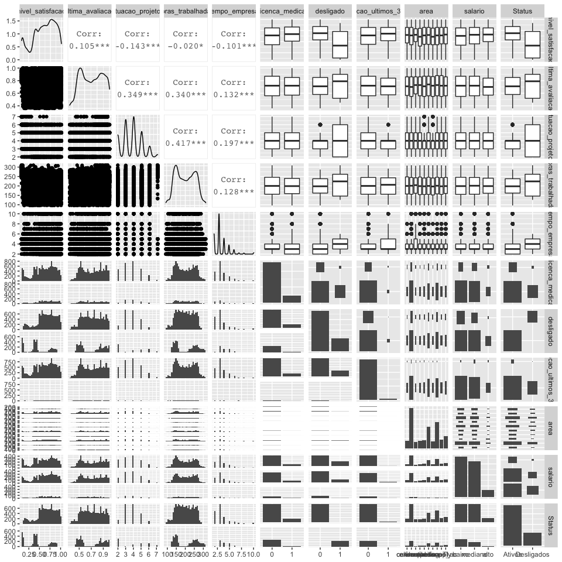
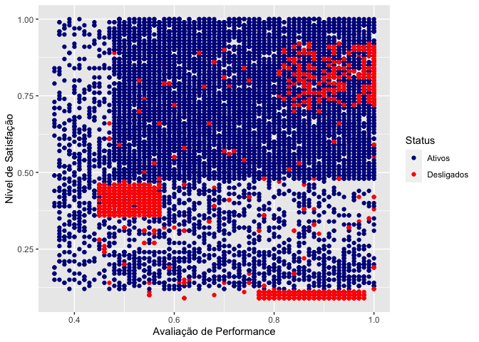
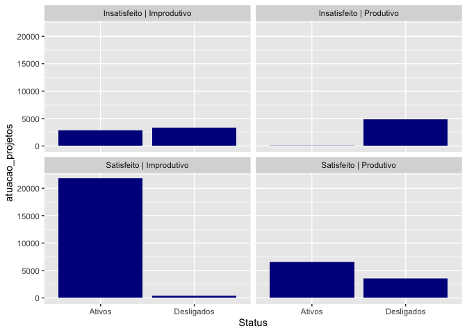
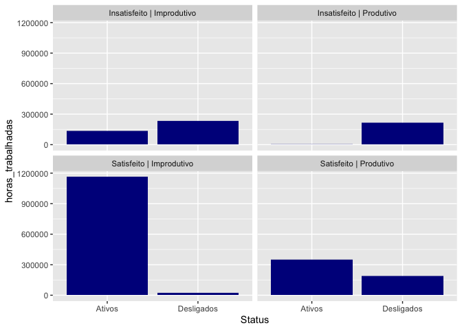
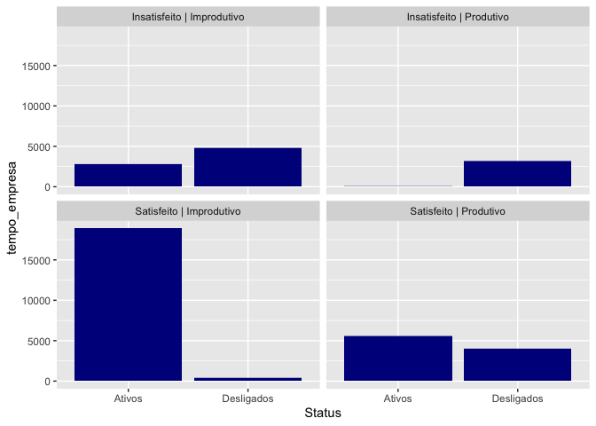
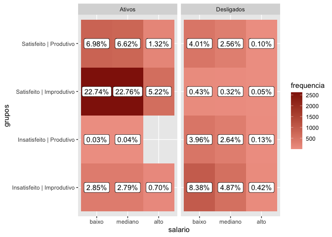
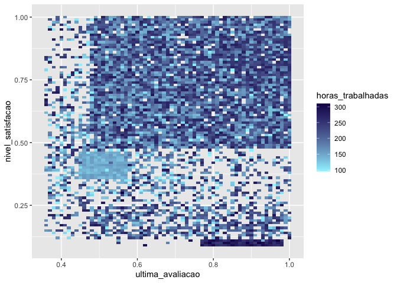
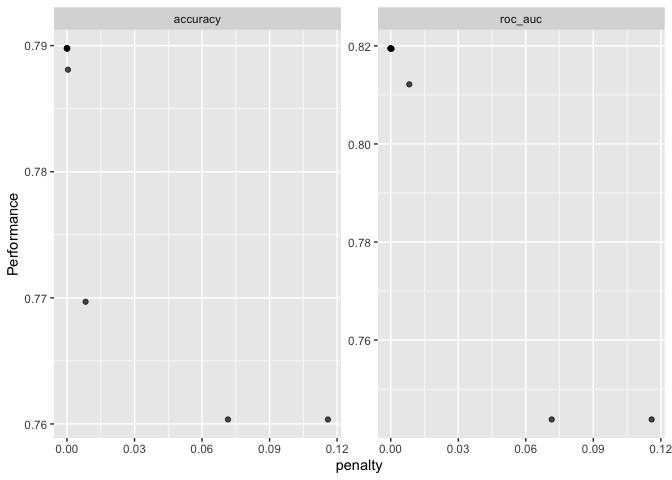
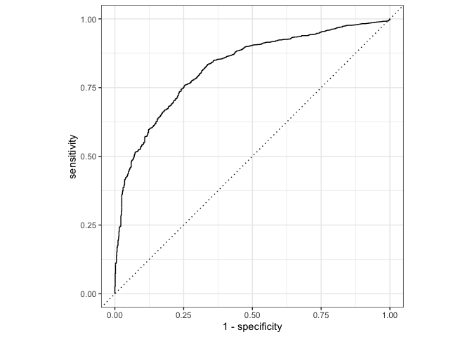
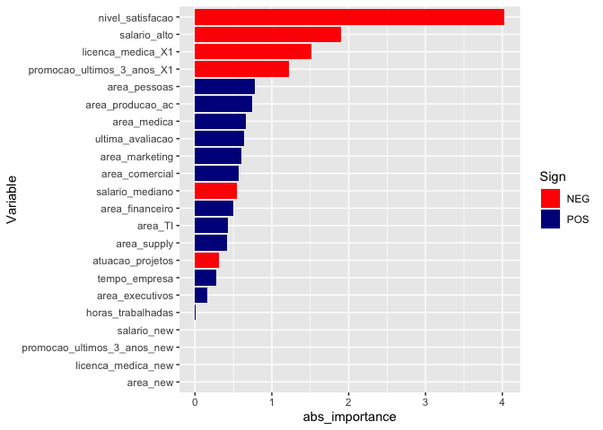

Análise em People Analytics - Turnover
================
Rodrigo Almeida Figueira
10/agosto/2020

  - [Introdução](#introdução)
  - [Entendimento do problema](#entendimento-do-problema)
  - [Base de dados](#base-de-dados)
  - [Análise Exploratória](#análise-exploratória)
      - [Análise de Performance versus Nível de
        Satisfação](#análise-de-performance-versus-nível-de-satisfação)
      - [Comparação de atributos entre Ativos e
        Desligados](#comparação-de-atributos-entre-ativos-e-desligados)
      - [Utilização gráficos mais
        elaborados](#utilização-gráficos-mais-elaborados)
  - [Modelagem](#modelagem)
  - [Conclusão](#conclusão)
  - [Comentários](#comentários)

-----

# Introdução

Neste pequeno projeto, farei uma abordagem mais voltada para a área de
People Analytics, que cresce cada vez mais nas empresas e que tem uma
gama de informações super legais para serem analisadas. Trabalharemos
com um problema bem comum no mercado de trabalho: turnover, que nada
mais é do que o processo de saída e entrada das vagas que uma
determinada empresa possui, a alta rotatividade dos funcionários.

Além disso, utilizarei o software R para implementar minhas análises e
modelagem. O modelo escolhido foi o de regressão logística, devido a
praticidade e facilidade de entendimento, mas nada nos impede de aplicar
um random forest, XGBoost, dentre outros que possuem melhor capacidade
preditiva. No mais, espero que gostem\!

# Entendimento do problema

O demandante está sendo impactado com a perda de funcionários
considerados talentos, em especial aqueles com certo tempo de casa.
Existe uma base de dados composta de diversos atributos dos funcinários
em relação a empresa, inclusive aqueles que foram desligados. Espera-se
descobrir onde e se existe relação entre os atributos observados e o
desligamento destes funcionários, além de verificar seus níveis de
satisfação juntamente com suas perfomances.

-----

# Base de dados

A base de dados conta com 14.999 observações, distibuídas em diversas
variáveis como consta na tabela abaixo:

| Variáveis                  |
| :------------------------- |
| nivel\_satisfacao          |
| ultima\_avaliacao          |
| atuacao\_projetos          |
| horas\_trabalhadas         |
| tempo\_empresa             |
| licenca\_medica            |
| desligado                  |
| promocao\_ultimos\_3\_anos |
| area                       |
| salario                    |

-----

# Análise Exploratória

Nesta etapa faremos as primeiras análises a fim de conhecermos e nos
ambientarmos à base de dados Turnover. Com isso, serão geradas análises
visuais que facilitem o entendimento e direcione nossas interpretações
sobre o problema.

Particularmente gosto de usar as funções abaixo para verificar
dimensões, estruturas e informações gerais dos dados.

``` r
#### verificando diemnsao e estrutura dos dados ####
dim(turnover)                 # dimensao
```

    ## [1] 14999    10

``` r
glimpse(turnover)             # estrutura
```

    ## Rows: 14,999
    ## Columns: 10
    ## $ nivel_satisfacao        <dbl> 0.38, 0.50, 0.11, 0.72, 0.37, 0.41, 0.10, 0.9…
    ## $ ultima_avaliacao        <dbl> 0.53, 0.86, 0.88, 0.87, 0.52, 0.50, 0.77, 0.8…
    ## $ atuacao_projetos        <int> 2, 5, 7, 5, 2, 2, 6, 5, 5, 2, 2, 6, 4, 2, 2, …
    ## $ horas_trabalhadas       <int> 157, 262, 272, 223, 159, 153, 247, 259, 224, …
    ## $ tempo_empresa           <int> 3, 6, 4, 5, 3, 3, 4, 5, 5, 3, 3, 4, 5, 3, 3, …
    ## $ licenca_medica          <int> 0, 0, 0, 0, 0, 0, 0, 0, 0, 0, 0, 0, 0, 0, 0, …
    ## $ desligado               <int> 1, 1, 1, 1, 1, 1, 1, 1, 1, 1, 1, 1, 1, 1, 1, …
    ## $ promocao_ultimos_3_anos <int> 0, 0, 0, 0, 0, 0, 0, 0, 0, 0, 0, 0, 0, 0, 0, …
    ## $ area                    <chr> "comercial", "comercial", "comercial", "comer…
    ## $ salario                 <chr> "baixo", "mediano", "mediano", "baixo", "baix…

``` r
skim(turnover)    # resumo detalhados das variáveis (pode usar um summary)
```

|                                                  |          |
| :----------------------------------------------- | :------- |
| Name                                             | turnover |
| Number of rows                                   | 14999    |
| Number of columns                                | 10       |
| \_\_\_\_\_\_\_\_\_\_\_\_\_\_\_\_\_\_\_\_\_\_\_   |          |
| Column type frequency:                           |          |
| character                                        | 2        |
| numeric                                          | 8        |
| \_\_\_\_\_\_\_\_\_\_\_\_\_\_\_\_\_\_\_\_\_\_\_\_ |          |
| Group variables                                  | None     |

Data summary

**Variable type: character**

| skim\_variable | n\_missing | complete\_rate | min | max | empty | n\_unique | whitespace |
| :------------- | ---------: | -------------: | --: | --: | ----: | --------: | ---------: |
| area           |          0 |              1 |   2 |  11 |     0 |        10 |          0 |
| salario        |          0 |              1 |   4 |   7 |     0 |         3 |          0 |

**Variable type: numeric**

| skim\_variable             | n\_missing | complete\_rate |   mean |    sd |    p0 |    p25 |    p50 |    p75 | p100 | hist  |
| :------------------------- | ---------: | -------------: | -----: | ----: | ----: | -----: | -----: | -----: | ---: | :---- |
| nivel\_satisfacao          |          0 |              1 |   0.61 |  0.25 |  0.09 |   0.44 |   0.64 |   0.82 |    1 | ▃▅▇▇▇ |
| ultima\_avaliacao          |          0 |              1 |   0.72 |  0.17 |  0.36 |   0.56 |   0.72 |   0.87 |    1 | ▂▇▆▇▇ |
| atuacao\_projetos          |          0 |              1 |   3.80 |  1.23 |  2.00 |   3.00 |   4.00 |   5.00 |    7 | ▇▆▃▂▁ |
| horas\_trabalhadas         |          0 |              1 | 201.05 | 49.94 | 96.00 | 156.00 | 200.00 | 245.00 |  310 | ▃▇▆▇▂ |
| tempo\_empresa             |          0 |              1 |   3.50 |  1.46 |  2.00 |   3.00 |   3.00 |   4.00 |   10 | ▇▃▁▁▁ |
| licenca\_medica            |          0 |              1 |   0.14 |  0.35 |  0.00 |   0.00 |   0.00 |   0.00 |    1 | ▇▁▁▁▂ |
| desligado                  |          0 |              1 |   0.24 |  0.43 |  0.00 |   0.00 |   0.00 |   0.00 |    1 | ▇▁▁▁▂ |
| promocao\_ultimos\_3\_anos |          0 |              1 |   0.02 |  0.14 |  0.00 |   0.00 |   0.00 |   0.00 |    1 | ▇▁▁▁▁ |

Como pudemos verificar, algumas variáveis precisam de mudança de
estrutura para serem melhores trabalhadas. São os casos das variáveis:
desligado, licença médica e promoção, em que tranformaremos para fator.
Além disso, criarei uma variável chamada Status (do colaborador) para
ficarem entendíveis e bonitos meus gráficos\! :)

``` r
turnover <- turnover %>% 
  mutate(
    desligado = as.factor(desligado),
    Status = ifelse(desligado == 1, "Desligados", "Ativos"),
    licenca_medica = as.factor(licenca_medica),
    promocao_ultimos_3_anos = as.factor(promocao_ultimos_3_anos),
    salario = factor(salario, levels = c("baixo", "mediano", "alto"))
  )
```

Feito isso, utilizaremos o pacote `GGally`, que traz a função `ggpairs`,
que faz uma análise de tudo contra todos, o que, muitas vezes, serve
para focar em determinados atributos que já demonstram ter algum tipo de
informação útil para nossa análise. O gráfico não fica muito bonito, mas
acho que o intuito é tentar criar um “chute inicial”.

``` r
GGally::ggpairs(turnover)
```

<!-- -->

Com o cruzamento acima, podemos já criar alguns questionamentos sobre a
situação dos funcionários desta empresa:

  - Quais os pontos relevantes que difenciam os funcionários ativos dos
    desligados?

  - O nível de satisfação é influenciado ou influencia algum outro
    atributo?

  - A avaliação de performance está sendo bem aplicada ou se relaciona a
    algum atributo?

Inicialmente ficaremos com estes questionamentos, mas durante o processo
de análise surgirão novas ideias e perguntas a serem abordadas.

#### Análise de Performance versus Nível de Satisfação

Uma das boas visualizações para o setor de People Analitcys é o gráfico
de dispersão cruzando satisfação, performance e desligamento de
funcionários. Ele pode, de cara, dizer muito na nossa análise. Vejamos:

``` r
turnover %>% 
  ggplot() +
    geom_point(aes(x = ultima_avaliacao, y = nivel_satisfacao, color = Status)) +
      labs(x = "Avaliação de Performance", y = "Nível de Satisfação") +
  scale_color_manual(values = c( "dark blue", "red"))
```



Podemos perceber que as duas variáveis são escalas de 0 a 1. Com isso,
pudemos notar que há quatro pontos gerais relevantes neste gráfico de
dispersão, por ordem de gravidade da situação:

  - Funcionários performando bem (\> 0,8) e com bom nível de satisfação
    (\> 0,75) estão com alto número de desligamentos (Satisfeito |
    Produtivo);

  - Funcionários com alta performance (\> 0,78/0,8) e com péssimo nível
    de satisfação (\< 0,12) estão com alto número de desligamentos
    (Insatisfeito | Produtivo);

  - Alto número de funcionários entre média e baixa performances (\<
    0,8) e entre médio e alto níveis de satisfação (\> 0.5) em situação
    ativa (Satisfeito | Improdutivo);

  - Concentração de funcionários desligados com baixa performance (\<
    0,6) e baixo nível de satisfação (\< 0,5), o que se mostra mais
    coerente neste gráfico, porém vamos avaliar melhor (Insatisfeito |
    Improdutivo).

Sabendo que existem situações bem graves no quadro de fucnionários dessa
empresa, vamos segmentar e avaliar a base de acordo com os quatro grupos
citados acima, para verificar se existem diferenças relevantes:

#### Comparação de atributos entre Ativos e Desligados

``` r
turnover <- turnover %>% 
  mutate(
    grupos = ifelse(nivel_satisfacao >= 0.75 & ultima_avaliacao >= 0.8, "Satisfeito | Produtivo",
                    ifelse(nivel_satisfacao <= 0.12 & ultima_avaliacao >= 0.8, "Insatisfeito | Produtivo",
                           ifelse(nivel_satisfacao > 0.5 & ultima_avaliacao < 0.8, "Satisfeito | Improdutivo",
                                  ifelse(nivel_satisfacao < 0.5 & ultima_avaliacao < 0.6, "Insatisfeito | Improdutivo", "Não analisar"))))
  )

turnover %>% 
  filter(!grupos == "Não analisar") %>% 
    ggplot(aes(x = Status, y = atuacao_projetos)) +
      geom_col(fill = "dark blue") +
        facet_wrap(~grupos)
```



``` r
turnover %>% 
  filter(!grupos == "Não analisar") %>% 
    ggplot(aes(x = Status, y = horas_trabalhadas)) +
      geom_col(fill = "dark blue") +
        facet_wrap(~grupos)
```



``` r
turnover %>% 
  filter(!grupos == "Não analisar") %>% 
    ggplot(aes(x = Status, y = tempo_empresa)) +
      geom_col(fill = "dark blue") +
        facet_wrap(~grupos)
```



Diante dos gráficos acima, pudemos observar alguns pontos interessantes:

  - O maior destaque fica para os funcionários Insatisfeitos |
    Produtivos e desligados, onde possuem altíssimo número de
    participações em projetos, com a análise reforçada quando olhamos
    as horas trabalhadas destes, que possuem mais que os outros grupos:
    *Carga de trabalho elevada?*

  - Além disso, os funcionários ativos Satisfeitos | Improdutivos têm
    mais horas trabalhadas quando comparados aos desligados: *O tempo
    destes está sendo bem empregado?*

  - Quando olhamos o tempo de empresa, o destaque fica para aqueles
    funcionários Satisfeitos | Improdutivos e desligados, em que possuem
    bem menos tempo de empresa: *Erro de contratação?*

#### Utilização gráficos mais elaborados

Através de gráficos um pouco mais elaborados, vamos aprofundar nossa
análise:

``` r
# salario por grupo
turnover %>% 
  filter(!grupos == "Não analisar") %>% 
    group_by(salario, grupos, Status) %>% 
      count(salario) %>%
        mutate(
          salario = factor(salario, levels = c("baixo", "mediano", "alto")),
          frequencia = n,
          percentual = percent(n/11498, accuracy = 0.01)
             ) %>% 
  ggplot(aes(x = salario, y = grupos)) +
    geom_tile(aes(fill =  frequencia)) +
      geom_label(aes(x = salario, y = grupos, label = percentual)) +
        facet_wrap(~Status) +
      scale_fill_gradient(low = "#f0a092", high = "#911d09")
```



Podemos verificar em relação ao patamar salarial alguns pontos
interessantes:

  - Patamar salarial alto predomina nos funcionários Satisfeitos |
    Improdutivos;

  - Dentre os deligados, há um baixo percentual de salarios altos para
    funcionários Satisfeitos | Produtivos e Insatisfeito | Produtivo.

*A empresa paga corretamente aqueles que mais produzem?*

Esta vizualização abaixo é meio redudante, pois já falamos sobre este
ponto, porém deixo aqui mais um opção para análise:

``` r
turnover %>% 
  ggplot(aes(x = ultima_avaliacao, y = nivel_satisfacao)) +
    geom_tile(aes(fill = horas_trabalhadas)) +
      scale_fill_gradient(low = "#9ef4ff", high = "#180b59")
```



Verificamos aqui o que falamos anteriormente, que os funcionários de
alta performance apresentam carga horária elevada de trabalho, enquanto
que existe também uma concentração de poucas horas trabalhadas naqueles
que consideramos Improdutivos | Insatisfeitos, o que pode indicar erro
de contratação.

Para quem chegou até aqui, peço pra não me xingar, mas eu acredito muito
que o processo que seguimos enriquece toda nosso poder de análise.
Porém, todavia, no entanto, alguns gráficos anteriormente utilizados se
resumem neste em seguida, que, particularmente, gosto demais\!

``` r
# analise de salario, grupo e atuacao em projetos
turnover %>% 
  ggplot(aes(x = ultima_avaliacao, y = nivel_satisfacao)) +
    geom_point(aes(color = Status)) +
      labs(x = "Avaliação de Performance", y = "Nível de Satisfação") +
        scale_color_manual(values = c( "dark blue", "red")) +
          facet_grid(atuacao_projetos~salario)
```


Neste gráfico de facetamento conseguimos cruzar cinco variáveis (quase
que uma análise multivariada rsrsrsrs)\! E nos traz muita informação. A
dica também é aplicar o `ggplotly`, do pacote `plotly`, em que fica tudo
dinâmico e podemos aplicar os zoons pra analisar melhor cada face. Como
já fiz análises mais detalhadas anteriormente, não o usarei.

Então, com este gráfico podemos verificar grande parte do que vimos:

  - Carga horária de trabalho elevada para aqueles que foram desligados
    e tem alta performance e baixa satisfação;

  - Salários entre médios e baixos para aqueles que foram desligados e
    possuem alta performance e satisfação;

  - Baixo número de projetos para aqueles que possuem baixa performance
    e baixa satisfação.

E aqui encerramos a nossa análise exploratória, que, convenhamos, nos
traz muita informação e fará ter mais segurança sobre os resultados da
nossa modelagem. Além disso, pudemos perceber que ficaram algumas
perguntas no ar. Ainda vamos respondê-las na nossa conclusão. E sim\!
Agora vamos para modelagem\!

# Modelagem

Para a modelagem eu uitlizarei o pacote `tidymodels`, que contém muitos
outros pacotes e funções apropriadas para Machine Learning e facilita
muito para quem lida com modelos diariamente\! Vale ressaltar que minha
vida mudou depois desse pacote\! rsrsrsrsrs E isso se deve muito ao
curso que fiz na [Curso-R](https://www.curso-r.com/), em que vi que
nesta vertente tem sempre coisas novas e que a comunidade está em
explosão de ideias e trocas de conhecimento\!

Sem mais delongas, vamos ao modelo:

Primeiro passo é separar a base de treino e teste e fazer o
pré-processamento da nossa base de dados. Isso envolve coisas como:
tratar missings, excluir variáveis inúteis ou contantes, dentre outras
milhares utilizades da função com prefixo `step`:

``` r
# treino e teste
set.seed(100)
treino_teste <- initial_split(turnover, 0.75)

base_treino <- training(treino_teste)
base_teste <- testing(treino_teste)

# pré processamento 
base_recipe <- base_treino %>% 
  recipe(desligado~., data = .) %>% 
    step_rm(grupos, Status) %>%  # colunas que nao utilizaremos
    step_zv(all_predictors()) %>% # exclui variáveis com variância = 0 (constantes)
      step_modeimpute(all_nominal(), -all_outcomes()) %>% # coloca a moda nos missings de variáveis nominais
        step_medianimpute(all_numeric()) %>% # coloca a mediana nos missings de variáveis numéricas
          step_novel(all_nominal(), -all_outcomes()) %>% # previni variáveis tipo fator de novas categorias
            step_dummy(all_nominal(), -all_outcomes()) # cria dummys para as variáveis nominais

prep(base_recipe)
```

    ## Data Recipe
    ## 
    ## Inputs:
    ## 
    ##       role #variables
    ##    outcome          1
    ##  predictor         11
    ## 
    ## Training data contained 11250 data points and no missing data.
    ## 
    ## Operations:
    ## 
    ## Variables removed grupos, Status [trained]
    ## Zero variance filter removed no terms [trained]
    ## Mode Imputation for licenca_medica, promocao_ultimos_3_anos, ... [trained]
    ## Median Imputation for nivel_satisfacao, ... [trained]
    ## Novel factor level assignment for licenca_medica, promocao_ultimos_3_anos, ... [trained]
    ## Dummy variables from licenca_medica, promocao_ultimos_3_anos, area, salario [trained]

``` r
head(juice(prep(base_recipe)))
```

    ## # A tibble: 6 x 23
    ##   nivel_satisfacao ultima_avaliacao atuacao_projetos horas_trabalhad…
    ##              <dbl>            <dbl>            <int>            <int>
    ## 1             0.5              0.86                5              262
    ## 2             0.11             0.88                7              272
    ## 3             0.72             0.87                5              223
    ## 4             0.37             0.52                2              159
    ## 5             0.92             0.85                5              259
    ## 6             0.89             1                   5              224
    ## # … with 19 more variables: tempo_empresa <int>, desligado <fct>,
    ## #   licenca_medica_X1 <dbl>, licenca_medica_new <dbl>,
    ## #   promocao_ultimos_3_anos_X1 <dbl>, promocao_ultimos_3_anos_new <dbl>,
    ## #   area_comercial <dbl>, area_executivos <dbl>, area_financeiro <dbl>,
    ## #   area_marketing <dbl>, area_medica <dbl>, area_pessoas <dbl>,
    ## #   area_producao_ac <dbl>, area_supply <dbl>, area_TI <dbl>, area_new <dbl>,
    ## #   salario_mediano <dbl>, salario_alto <dbl>, salario_new <dbl>

Agora que já tratamos nossa base de dados, vamos preparar nosso modelo,
a reamostragem (validação cruzada) e colocar tudo num objetito chamado
wokflow, em que agrega todos os elementos da nossa modelagem:

``` r
# modelo - regressao logistica
modelo_rl <- logistic_reg(
  penalty = tune(),
  mixture = 1
) %>% 
  set_engine("glmnet")

# validação cruzada
reamostragem <- vfold_cv(base_treino, v = 5)

# worflow
base_wk <- workflow() %>% 
  add_model(modelo_rl) %>% 
  add_recipe(base_recipe)
```

Com tudo pronto, agora vamos tunar os hiperparâmetros do nosso modelo, a
fim de encontrar a melhor combinação para o tal de acordo com a métrica
selecionada. Neste caso escolhemos `roc_auc`:

``` r
# tunagem
tunagem_modelo_rl <- tune_grid(
  base_wk,
  resamples = reamostragem,
  metrics = metric_set(roc_auc, accuracy)
)

# escolha melhor hiperparametro
autoplot(tunagem_modelo_rl)
```

<!-- -->

``` r
show_best(tunagem_modelo_rl, metric = "roc_auc")
```

    ## # A tibble: 5 x 6
    ##    penalty .metric .estimator  mean     n std_err
    ##      <dbl> <chr>   <chr>      <dbl> <int>   <dbl>
    ## 1 5.57e-10 roc_auc binary     0.819     5 0.00477
    ## 2 5.23e- 9 roc_auc binary     0.819     5 0.00477
    ## 3 1.10e- 8 roc_auc binary     0.819     5 0.00477
    ## 4 1.20e- 7 roc_auc binary     0.819     5 0.00477
    ## 5 3.26e- 6 roc_auc binary     0.819     5 0.00477

``` r
melhor_hp <- select_best(tunagem_modelo_rl, "roc_auc")

# atualizacao worflow
base_wk <- base_wk %>% 
  finalize_workflow(melhor_hp)
```

Modelo tunado, workflow atualizado, agora vamos testar nosso modelo e
verificar as métricas dele:

``` r
# modelo final
modelo_fit <- last_fit(
  base_wk,
  treino_teste
)

# métricas do modelo
collect_metrics(modelo_fit)
```

    ## # A tibble: 2 x 3
    ##   .metric  .estimator .estimate
    ##   <chr>    <chr>          <dbl>
    ## 1 accuracy binary         0.796
    ## 2 roc_auc  binary         0.824

``` r
# curva roc
collect_predictions(modelo_fit) %>% 
  roc_curve(desligado, .pred_1) %>% 
  autoplot()
```



Vimos que nossa roc\_auc está em 82% e acurácia de 79%. Bom patamar.
Talvez um XGBoost consiga mais poder de predição, porém, um dos fatores
de escolher a regressão logística é ela me retornar, além dos
coeficientes de importância das variáveis, a relação das mesmas com a
variável resposta. Com isso, podemos ter o seguinte gráfico:

``` r
vi(extract_model(modelo_fit$.workflow[[1]])) %>% 
  mutate(
    abs_importance = abs(Importance),
    Variable = fct_reorder(Variable, abs_importance)
) %>%
  ggplot(aes(x = abs_importance, y = Variable)) +
    geom_col(aes(fill = Sign)) +
      scale_fill_manual(values = c("red", "dark blue"))
```



Podemos verificar que, de acordo com nossa análise exploratória, boas
variáveis para classificar os indivíduos desligaos são o nível de
satisfação, salário, promoção e última avaliação. Além disso, o modelo
nos traz a informação de que as áreas de trabahos são boas preditoras
juntamente com o a variável licença médica.

Tudo avaliado, agora podemos salvar nosso modelo pra usar
posteriormente, junto com nosso gráfico e importância das variáveis:

``` r
# modelo final 
modelo_rl_turnover <- fit(base_wk, data = turnover)

#salvando o modelo
saveRDS(modelo_rl_turnover, file = "modelo_rl_tunover.rds")

# guardar importancia das variaveis
ggsave(filename = "Importancia_variaveis_turnover.jpeg",
      device = "jpeg", width = 10, height = 6, dpi = 300)
```

# Conclusão

Com todas as análises feitas, nós podemos recomendar e direcionar alguns
pontos para esta empresa:

  - Controle de cargas horárias e atuações em projetos, pois bons
    profissionais estão sendo sobrecarregados;

  - Reconhecimento salarial para aqueles que cumprem suas metas, pois
    existem funcionários menos produtivos que ganham mais do que aqueles
    produtivos;

  - Melhorar a qualidade do recrutamento ou de contratação a fim de
    minimizar o desalinhamento dos profissionais e deixá-los
    insatisfeitos e improdutivos;

  - Avaliar as áreas de pessoas e produção\_ac, que representam grande
    chance de desligamento;

  - Veirificar se os direitos à licença médica estão sendo devidamente
    cumpridos, pois os funcionários que não exerceram esse direito tem
    mais chance de saída.

No mais, a empresa deve também dar mais atenão à satisfação de seus
colaboradores e rever o processo de avalição de performance para
verificar se este está sendo devidamente coerente.

# Comentários

Esta foi uma pequena amostra do que lido no meu dia a dia. Esta base é
fictícia e está no portal Kaggle, só não lembro exatamente onde rsrsrsrs
Espero que possa contribuir com alguém e qualquer feedbak, só mandar no
meu LinkedIn [Rodrigo
Almeida](https://www.linkedin.com/in/rodrigoalmeidafigueira/).

Valeu\!\! :)
